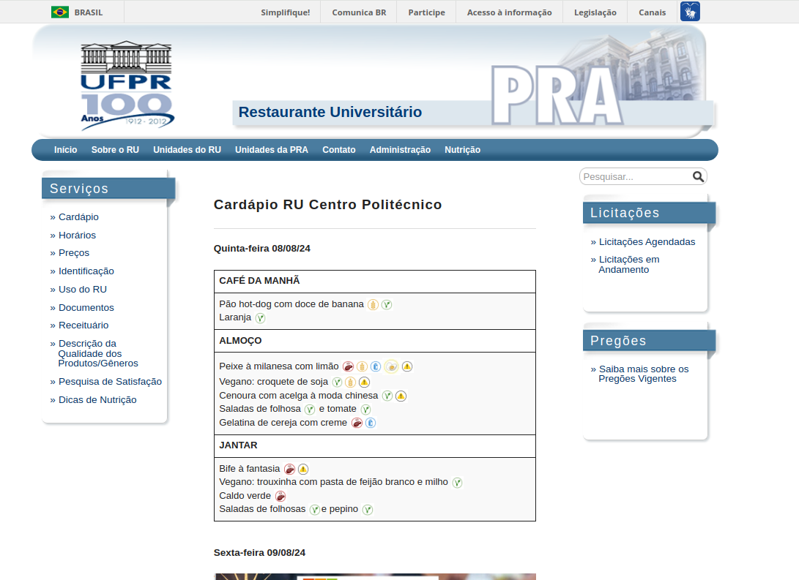
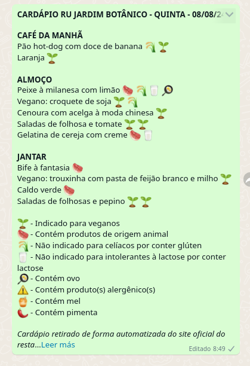

# RU Menu Project

A Java-based web scraper designed to retrieve and send the daily menu from the Restaurante Universitário (RU) of the Federal University of Paraná (UFPR) to anyone interested.

## Why?

Every day, thousands of people visit the university’s website just to check what’s being served at the RU (Restaurante Universitário) from Monday to Friday. Many even take screenshots to share the menu on WhatsApp.

This project was created to automate that process by sending the menu directly via WhatsApp every evening after the closing hour of the restaurant. It simplifies the daily routine for thousands of people, giving them access to the menu the night before, making it easier to plan and share it in their WhatsApp conversations.

Currently, the project supports **4 different university restaurants**, each with its own menu. Below, you can access each WhatsApp channel to see how everything works from the user perspective. All content is in Portuguese.

RU [Agrárias](https://whatsapp.com/channel/0029Vb3bhFf9sBI5Z3SY9D1F) | RU [Central](https://whatsapp.com/channel/0029VazQCEaEQIarkT6jii2o) | RU [Botânico](https://whatsapp.com/channel/0029VaoDsH20QeaeWkvBcP0Z) | RU [Politécnico](https://whatsapp.com/channel/0029VajNanJEAKWIRxfDnl3I)

## DAU

Right now, the system has **6832 daily active users** who receive the menu every day.

- Agrárias = 821 users
- Botânico = 1631 users
- Central = 1348 users
- Politécnico = 3032 users

Last updated at 04/12/2025 18:21:53 UTC

## Tech used

- **Java 17**: The core programming language used for the scraper.
- **Spring Cloud Function**: A framework to create stand-alone, production-grade Spring-based applications.
- **JSoup:** A Java library for parsing HTML, used here for web scraping.
- **Node.js**: Used to send messages via WhatsApp.
- **Baileys:** A third-party library that enables sending WhatsApp messages to channels.

## Data flow

Every workday at 5 AM, EventBridge triggers the ru-scraper function, which retrieves the parsed HTML menu and sends it to ru-whatsapp for formatting and delivery to a WhatsApp channel.


## Flexible code & modularization

The entire project was designed to be as flexible as possible. Since the university has multiple restaurants, the code and infrastructure were made to be easily adaptable and deployable.

An example can be seen in the diagram, where two restaurants (Politécnico and Botânico) have their own data pipelines.

The database for the WhatsApp profile data and the database used for the scraper status are shared between different restaurant services.


## Cloud infrastructure

The project uses AWS cloud services to provide multiple services, making it easier to maintain and develop new features.

- **EventBridge:** Uses cron expressions to trigger the entire application.
- **CodeBuild:** Enables triggering the CI/CD pipeline stored on GitHub.
- **Lambda:** A low-cost and efficient way to run applications.
- **CloudWatch:** Monitors logs and responses.

## CI/CD process

Each function has a buildspec file that provides CodeBuild commands for the correct build and deployment. Functions are deployed to Lambda as zip files.

Node.js 17 and Java 17 are used.


## Example of a scenario

The happy path of the data pipeline is `website` -> `scraper` -> `sender` -> `WhatsApp`.

The image below is available at this [link](https://gxlpes.github.io/ru-menu/website-example/ru-website-pol-1208-0908.html), where I saved an example.



After processing by the scraper function, this response is sent to the function responsable for sending the WhatsApp message.

The JSON format with its keys was thought for a more general approach. This JSON is generated by the scraper function.

```
{
  "date": "2024-08-25T21:15:44.593395018-03:00",
  "imgMenu": null,
  "ruName": "JARDIM BOTÂNICO",
  "ruUrl": "https://gxlpes.github.io/ru-menu/website-example/ru-website-pol-0908-0808.html",
  "ruCode": "BOT",
  "served": [
    "breakfast",
    "lunch",
    "dinner"
  ],
  "meals": {
    "lunch": [
      {
        "name": "Peixe à milanesa com limão",
        "icons": [
          "Origem-animal-site",
          "Gluten-site",
          "Leite-e-derivados-site",
          "Ovo-site",
          "Alergenicos-site"
        ]
      },
      {
        "name": "Vegano: croquete de soja",
        "icons": [
          "Simbolo-vegano-300x300",
          "Gluten-site",
          "Alergenicos-site"
        ]
      },
      {
        "name": "Cenoura com acelga à moda chinesa",
        "icons": [
          "Simbolo-vegano-300x300",
          "Alergenicos-site"
        ]
      },
      {
        "name": "Saladas de folhosa e tomate",
        "icons": [
          "Simbolo-vegano-300x300",
          "Simbolo-vegano-300x300"
        ]
      },
      {
        "name": "Gelatina de cereja com creme",
        "icons": [
          "Origem-animal-site",
          "Leite-e-derivados-site"
        ]
      }
    ],
    "breakfast": [
      {
        "name": "Pão hot-dog com doce de banana",
        "icons": [
          "Gluten-site",
          "Simbolo-vegano-300x300"
        ]
      },
      {
        "name": "Laranja",
        "icons": [
          "Simbolo-vegano-300x300"
        ]
      }
    ],
    "dinner": [
      {
        "name": "Bife à fantasia",
        "icons": [
          "Origem-animal-site",
          "Alergenicos-site"
        ]
      },
      {
        "name": "Vegano: trouxinha com pasta de feijão branco e milho",
        "icons": [
          "Simbolo-vegano-300x300"
        ]
      },
      {
        "name": "Caldo verde",
        "icons": [
          "Origem-animal-site"
        ]
      },
      {
        "name": "Saladas de folhosas e pepino",
        "icons": [
          "Simbolo-vegano-300x300",
          "Simbolo-vegano-300x300"
        ]
      }
    ]
  }
}
```

After getting this JSON formatted data, the sender function can then format in a WhatsApp message with proper formatting and emojis.



## Future improvements (TODO)

- Make better testing cases
- Improve the overall documentation
- Create other services (saver, collector)
